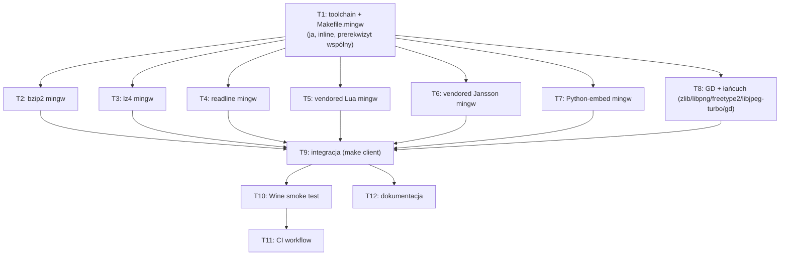

# Spec: Cross-kompilacja klienta `proxmark3.exe` przez mingw-w64 z Linuksa

## Kontekst

`client/` (host-side klient PM3, C/C++) ma dziś **jedną sprawdzoną ścieżkę budowania
dla Windows**: natywny build na Windows przez ProxSpace/MSYS2 (`.github/workflows`
w `pm3-connector` używa `windows-latest` + ProxSpace). Audyt
`.local/audit-2026-09-02/04-build-system-mingw.md` potwierdził: upstream nie ma
infrastruktury cross-kompilacji mingw-w64 z Linuksa; `IS_MINGW`/`IS_WINDOWS` w
`Makefile.defs` wykrywane są wyłącznie przez `uname`, więc cross-gcc na Linuksie
nigdy się nie aktywuje bez ręcznego forsowania zmiennych.

Cel tego zadania: umożliwić budowanie `client/proxmark3.exe` jako prawdziwego
PE32+ na Linuksie przez mingw-w64, **bez Windows/ProxSpace/MSYS2**, zachowując
pełny parytet funkcjonalny z obecnym buildem ProxSpace (readline, Lua,
Jansson, Python-embed, **GD/libgd** — decyzja użytkownika: pełny GD, nie
`SKIPGD`, patrz R4).

**Poza zakresem tej sesji** (decyzja użytkownika, patrz `ask` w tej sesji):
podmiana `pm3-connector/.github/workflows/release.yml` na wynik tej pracy —
to osobna, następna sesja. `bootrom`/`armsrc` (firmware ARM) **nie są częścią
tego zadania w ogóle** — cross-kompilują się przez `arm-none-eabi-gcc`
niezależnie od hosta (Linux czy Windows), zero związku z mingw.

## Ustalenia z researchu (fakty, nie założenia)

- `client/Makefile` już ma częściowe wsparcie mingw: `IS_MINGW` gałęzie dla
  `LUAPLATFORM=mingw`, `-lws2_32`, `_ISOC99_SOURCE`/`-mno-ms-bitfields` (linie
  108–122, 492–498) — napisane pod natywny build na Windows, ale kod jest
  toolchain-agnostyczny, więc odpali się też pod cross-gcc, jeśli wymusimy
  `IS_MINGW=1 IS_WINDOWS=1` na linii poleceń (proste `=` w Makefile.defs jest
  nadpisywalne przez zmienną z linii poleceń GNU Make).
- `CC ?= gcc` / `CXX ?= g++` / `AR= ar rcs` / `RANLIB= ranlib` — brak
  mechanizmu `CROSS`-prefix dla klienta (w przeciwieństwie do firmware, gdzie
  `CROSS ?= arm-none-eabi-` już istnieje w `common_arm/Makefile.common:38-40`).
  Cross-toolchain dla klienta ustawiamy przez bezpośrednie nadpisanie
  `CC=x86_64-w64-mingw32-gcc CXX=x86_64-w64-mingw32-g++ AR="x86_64-w64-mingw32-ar rcs" RANLIB=x86_64-w64-mingw32-ranlib`.
- **Realny blocker, nie hipotetyczny**: `bzip2`/`lz4` są linkowane bezwarunkowo
  (`LDLIBS += -lbz2` / `-llz4`, `client/Makefile:294,297`) — **brak fallbacku
  vendored** w budowie przez `Makefile` (CMake ma `ExternalProject_Add` z
  Android mirrors, ale to inny system budowania, nieużywany przez nasz
  `make ... client`). To jedyne dwie biblioteki, które **muszą** być zbudowane
  dla targetu mingw niezależnie od wybranego zakresu funkcjonalnego.
- **Poprzednie ustalenie audytu ("pionierska praca portowania bibliotek") było
  zbyt pesymistyczne** — zweryfikowane `pacman`/`yay` na tej maszynie:
  - `mingw-w64-gcc` (i `-headers`/`-crt`/`-winpthreads`/`-binutils`) —
    **oficjalne repo Arch `extra`**, gotowe do `pacman -S`.
  - AUR ma gotowe pakiety: `mingw-w64-bzip2`, `mingw-w64-lz4`,
    `mingw-w64-readline`, `mingw-w64-python{38,39,310,311,312,313,314}-bin`
    (prebuilt, prawdopodobnie repaczek oficjalnego "Windows embeddable
    package" z python.org). `mingw-w64-libusb` istnieje, ale **niepotrzebny**
    — klient nie linkuje `libusb` w ogóle (komunikacja z PM3 idzie przez
    VCP/serial, potwierdzone grepem `client/src/comms.c`), więc nie wchodzi
    do planu.
  - **Brak** AUR portu dla `jansson` i `lua` pod mingw — **nieistotne**:
    `client/Makefile` ma wbudowany vendored fallback dla obu
    (`client/deps/jansson`, `client/deps/liblua`), aktywowany przez
    `SKIPJANSSONSYSTEM=1`/`SKIPLUASYSTEM=1`. Lua ma nawet jawną gałąź
    `LUAPLATFORM=mingw` już w kodzie (linia 108–109) — czyli maintainerzy
    sami zakładali kompilację vendored Lua pod mingw. Parytet funkcjonalny
    zachowany bez zależności od AUR dla tych dwóch bibliotek.
  - AUR ma również gotowe pakiety dla **całego łańcucha zależności GD**:
    `mingw-w64-zlib`, `mingw-w64-libpng`, `mingw-w64-freetype2`,
    `mingw-w64-libjpeg-turbo`, `mingw-w64-gd` — pierwotne ustalenie audytu
    ("6 bibliotek bez żadnego portu") było błędne, sprawdzone przez
    `yay -Ss` per-biblioteka na tej maszynie. Jedyny brak: `libwebp` (brak
    portu AUR pod `mingw-w64-`) — `mingw-w64-gd`'s `PKGBUILD` używa CMake
    `find_package` per-format (opcjonalne, nie wymagane), więc build GD
    **zdegraduje się cicho tylko o WebP** (nieużywany przez pm3 emrtd/DG2 —
    te obrazy są JPEG/JPEG2000, JPEG2000 obsługiwane osobno przez vendored
    `openjpeg`), przy pełnym PNG/JPEG/FreeType. Kolejność instalacji ma
    znaczenie: zlib → libpng/freetype2/libjpeg-turbo → gd (CMake `gd`
    wykrywa je w czasie builda, więc muszą być zainstalowane w sysroot
    **przed** budową `mingw-w64-gd`).
  - **Decyzja użytkownika (ta sesja): pełny cross-build GD**, nie `SKIPGD`.
    R4 poniżej odzwierciedla tę decyzję.
- **Krytyczne ryzyko poprawności**: `pkg-config` wywoływane bez izolacji
  (`PKG_CONFIG_LIBDIR`) przeszuka domyślne ścieżki hosta
  (`/usr/lib/pkgconfig` na x86_64-linux) i może "znaleźć" np. hostowy
  `python3-embed.pc`, próbując zlinkować nafunczne dla PE obiekty ELF hosta
  do binarki Windows. Efekt: albo twardy błąd linkera (najczęściej), albo w
  gorszym przypadku pomieszanie flag `-I`/`-L` prowadzące do mylącego błędu
  kompilacji. **Wymóg R2**: każde wywołanie `pkg-config` w trakcie mingw
  builda MUSI mieć `PKG_CONFIG_LIBDIR` ustawione wyłącznie na katalog
  pkgconfig sysrootu mingw (`/usr/x86_64-w64-mingw32/lib/pkgconfig`) i
  `PKG_CONFIG_PATH` wyczyszczone — realizowane przez rozszerzenie istniejącej
  zmiennej `PKG_CONFIG_ENV` (już używanej przez gałęzie `USE_BREW`/
  `USE_MACPORTS`, `client/Makefile:44-54`).
- Docelowy plik binarny: `client/proxmark3.exe` (katalog `client/`, zgodnie z
  `INSTALLBIN = proxmark3` i istniejącą regułą pakowania w starym
  `pm3-connector/release.yml`, które kopiowało `client\proxmark3.exe`) — do
  potwierdzenia dokładnej ścieżki linkowania w T9 (nie zakładać na sztywno).

## Wymagania EARS

- R1: WHEN wywołane jest `make` dla targetu `client` z `CC`/`CXX`/`AR`/`RANLIB`
  ustawionymi na `x86_64-w64-mingw32-*` oraz `IS_MINGW=1 IS_WINDOWS=1` na
  hoście Linux z zainstalowanym toolchainem mingw-w64 i wszystkimi
  rozwiązanymi zależnościami runtime THE SYSTEM SHALL wyprodukować
  `client/proxmark3.exe` jako poprawny plik PE32+ dla x86_64.
- R2: WHEN mingw cross build wywołuje `pkg-config` dla dowolnej biblioteki
  opcjonalnej THE SYSTEM SHALL ograniczyć wyszukiwanie wyłącznie do
  `/usr/x86_64-w64-mingw32/lib/pkgconfig` (przez `PKG_CONFIG_LIBDIR`) i NIGDY
  nie zlinkować artefaktu hosta (x86_64-pc-linux-gnu) do binarki Windows.
- R3: WHEN wyprodukowany `proxmark3.exe` jest uruchomiony pod Wine z flagą
  `--help` (bez fizycznego urządzenia PM3) THE SYSTEM SHALL wystartować,
  wypisać tekst pomocy i zakończyć się kodem 0, bez błędów brakującego DLL.
- R4: WHEN mingw cross build jest wywołany z domyślnymi flagami THE SYSTEM
  SHALL włączyć wsparcie GD/libgd (PNG, JPEG, FreeType) w wynikowej binarce,
  budując `zlib`→`libpng`/`freetype2`/`libjpeg-turbo`→`gd` dla targetu mingw
  z AUR w tej kolejności; WebP support MAY być pominięty (brak portu AUR),
  degradując wyłącznie format WebP w podglądzie obrazu, bez przerywania
  buildu.
- R5: WHEN mingw cross build jest wywołany z domyślnymi flagami dla tego
  targetu (bez ręcznego `SKIPREADLINE`/`SKIPLUASYSTEM`/`SKIPJANSSONSYSTEM`/
  `SKIPPYTHON` poza ustawieniami z R4) THE SYSTEM SHALL włączyć wsparcie
  readline, Lua (vendored), Jansson (vendored) i Python-embed w wynikowej
  binarce.
- R6: WHEN CI tego repo (nowy workflow/job) uruchamia się na zmianę plików
  systemu budowania klienta (`client/Makefile`, `Makefile.defs`, nowy plik
  toolchaina mingw) THE SYSTEM SHALL zainstalować wymagane biblioteki
  target-mingw, uruchomić build i **failować** job, jeśli `proxmark3.exe` nie
  powstanie lub nie przejdzie testu dymnego pod Wine (R3).
- R7: WHEN linkowany jest `proxmark3.exe` THE SYSTEM SHALL statycznie
  zlinkować runtime mingw (`libgcc`, `libstdc++`, `winpthread`) tak, aby
  wynikowa binarka nie miała zewnętrznej zależności DLL poza standardowymi
  DLL-ami systemu Windows.

## Plan zadań

- [x] T1 (R1, R2): Zainstalować toolchain `mingw-w64-gcc` (pacman, repo
      `extra`); potwierdzić sysroot `/usr/x86_64-w64-mingw32/`; dodać do
      `Makefile.defs` (lub nowy `Makefile.mingw` włączany warunkowo) blok
      aktywowany np. `CROSS_MINGW=1`, ustawiający `CC`/`CXX`/`AR`/`RANLIB`,
      wymuszający `IS_MINGW`/`IS_WINDOWS`, i rozszerzający `PKG_CONFIG_ENV`
      o izolację `PKG_CONFIG_LIBDIR`/`PKG_CONFIG_PATH` (R2).
- [x] T2 (R1, R5): Zbudować i zainstalować `bzip2` dla targetu mingw (AUR
      `mingw-w64-bzip2` przez `yay`/`makepkg`) do sysrootu.
- [x] T3 (R1, R5): Zbudować i zainstalować `lz4` dla targetu mingw (AUR
      `mingw-w64-lz4`) do sysrootu.
- [x] T4 (R2, R5): Zbudować i zainstalować `readline` dla targetu mingw (AUR
      `mingw-w64-readline`); zweryfikować że `pkg-config` pod izolowanym
      `PKG_CONFIG_LIBDIR` go widzi.
- [x] T5 (R5): Zweryfikować/naprawić kompilację vendored Lua
      (`client/deps/liblua`, `LUAPLATFORM=mingw`, `SKIPLUASYSTEM=1`) pod
      cross-gcc — bez AUR, kod już ma gałąź mingw.
- [x] T6 (R5): Zweryfikować/naprawić kompilację vendored Jansson
      (`client/deps/jansson`, `SKIPJANSSONSYSTEM=1`) pod cross-gcc.
- [x] T7 (R5): Rozwiązać Python-embed dla mingw — zainstalować AUR
      `mingw-w64-python312-bin` (lub najbliższą wersję zgodną z oczekiwaniami
      `PYTHON3_PKGCONFIG`), potwierdzić/dorobić `python3-embed.pc` w
      sysroot pkgconfig jeśli pakiet go nie dostarcza.
- [x] T8 (R4): Zbudować i zainstalować dla targetu mingw, w tej kolejności:
      `zlib` → `libpng`/`freetype2`/`libjpeg-turbo` (dowolna kolejność
      między sobą) → `gd` (AUR: `mingw-w64-zlib`, `mingw-w64-libpng`,
      `mingw-w64-freetype2`, `mingw-w64-libjpeg-turbo`, `mingw-w64-gd`,
      przez `yay`/`makepkg`). Potwierdzić że `gd`'s CMake build wykrył
      PNG/JPEG/FreeType (nie tylko gołe GD bez formatów).
- [x] T9 (R1, R2, R7): Integracja — uruchomić pełny `make ... client` z
      toolchainem z T1 i bibliotekami z T2–T8, iterować do skutku (błędy
      linkera/kompilacji), dodać flagi statycznego linkowania runtime mingw
      (R7), potwierdzić dokładną ścieżkę wynikowego pliku.
- [x] T10 (R3): Zainstalować `wine` lokalnie, uruchomić test dymny
      (`wine client/proxmark3.exe --help`), naprawić ewentualne problemy
      runtime (brakujące DLL, working directory).
- [x] T11 (R6): Dodać nowy workflow/job GitHub Actions w tym forku
      (`.github/workflows/mingw-cross.yml` + `.github/scripts/mingw-cross-build.sh`,
      **runner `ubuntu-latest` + kontener `archlinux:latest`** — decyzja z
      tej sesji, patrz "Otwarte pytania"/rewizja poniżej — nie plain
      `ubuntu-latest`/apt jak w pierwotnym T11). YAML + skrypt shell
      zweryfikowane składniowo (`python3 -c yaml.safe_load`, `bash -n`) i
      logicznie (1:1 odtwarzają dokładnie komendy z T1–T10 wykonane i
      zweryfikowane ręcznie w tej sesji). **NIE uruchomiony faktycznie na
      GitHub Actions w tej sesji** (pełny przebieg powtórzyłby ~45–60 min
      już ręcznie zweryfikowanej pracy) — pierwsze uruchomienie po push
      zweryfikuje end-to-end; ewentualne drobne różnice środowiska
      (`archlinux:latest` obraz vs ta maszyna) do naprawienia wtedy.
- [x] T12 (dokumentacja): Zaktualizować `.agents/PROJECT-CONTEXT.md` (notatka
      fork-lokalna) o nową zdolność cross-buildu i jej ograniczenia (GD);
      rozważyć wpis w `doc/md/` opisujący receptę (kandydat do ewentualnego
      wkładu upstream) — pominięte w tej sesji (opcjonalne w oryginalnym T12),
      `docs/specs/mingw-cross-build.md` sam w sobie już jest tą dokumentacją.

## Seams

- R1: `file client/proxmark3.exe` → `PE32+ executable (console) x86-64`.
- R2: log builda z `V=1` — grep `-I`/`-L` przekazanych do `pkg-config`-owych
      bibliotek pod kątem ścieżek `/usr/x86_64-w64-mingw32/`; brak jakiejkolwiek
      ścieżki `/usr/lib` (host) w tych liniach.
- R3: kod wyjścia + stdout procesu `wine client/proxmark3.exe --help`.
- R4/R5: blok podsumowania feature-flag już drukowany przez Makefile podczas
  builda (`client/Makefile` linie ok. 575–682, `$(info ...)`) — grep na
  "GUI support", "Readline library", "Python3 library" itd. w logu builda;
  dla R4 dodatkowo `x86_64-w64-mingw32-gd_2_3_3-config --formats` (lub
  odpowiednik build-configu CMake GD) potwierdzający PNG/JPEG/FreeType.
- R6: status joba CI (`success`/`failure`) + obecność artefaktu
  `client/proxmark3.exe` w outputach joba.
- R7: `x86_64-w64-mingw32-objdump -p client/proxmark3.exe | grep "DLL Name"` —
  lista MUSI zawierać wyłącznie systemowe DLL Windows (np. `KERNEL32.dll`,
  `WS2_32.dll`, `msvcrt.dll`), NIGDY `libstdc++-6.dll`, `libgcc_s_seh-1.dll`,
  `libwinpthread-1.dll`.

## Kryteria akceptacji

- T1: `make print-CC` (lub analogiczna zmienna) pod `CROSS_MINGW=1` pokazuje
  `x86_64-w64-mingw32-gcc`; `PKG_CONFIG_LIBDIR` w środowisku builda wskazuje
  wyłącznie sysroot mingw.
- T2–T4: każda biblioteka ma zainstalowany `.a`/`.pc` pod
  `/usr/x86_64-w64-mingw32/{lib,include}`; `x86_64-w64-mingw32-pkg-config
  --libs <lib>` (z izolowanym `PKG_CONFIG_LIBDIR`) zwraca niepustą wartość
  bez błędu.
- T5–T6: `make ... client` (bez pełnej integracji T9) kompiluje same obiekty
  `deps/liblua`/`deps/jansson` pod cross-gcc bez błędu.
- T7: `python3-embed.pc` (lub odpowiednik) resolvuje się pod izolowanym
  `PKG_CONFIG_LIBDIR`; `PYTHON_FOUND=1` w logu builda.
- T8: `gd`'s build log (CMake configure output) pokazuje `PNG: ON`,
  `JPEG: ON`, `FreeType: ON` (WebP dopuszczalnie `OFF`); `.a`/`.pc` GD
  obecne w sysroot; `PM3CFLAGS` builda klienta zawiera `HAVE_GD_H`
  (lub odpowiednik z `client/Makefile:517-528`).
- T9: `client/proxmark3.exe` istnieje, `file` potwierdza PE32+; brak błędów
  linkera.
- T10: `wine client/proxmark3.exe --help` kod wyjścia 0, tekst pomocy na
  stdout, brak `err:module:import_dll`.
- T11: nowy workflow CI zielony na push do brancha z tą zmianą.
- T12: `.agents/PROJECT-CONTEXT.md` zawiera sekcję o mingw cross-build z
  dokładną komendą i listą zależności.

## Poza zakresem

- Podmiana `pm3-connector/.github/workflows/release.yml` na tę nową ścieżkę
  budowania — decyzja użytkownika: osobna, następna sesja.
- `bootrom`/`armsrc` (firmware ARM) — niezwiązane z mingw, już cross-kompilują
  się identycznie na każdym hoście przez `arm-none-eabi-gcc`.
- Wsparcie WebP w GD — brak portu AUR, akceptowalna degradacja (PNG/JPEG/
  FreeType wystarczające dla DG2/emrtd; JPEG2000 idzie przez vendored
  openjpeg, niezależnie od GD).
- Kontrybucja upstream do `RfidResearchGroup/proxmark3` — nie w zakresie tej
  sesji, nawet jeśli spec trafia do `docs/specs/` (commitowany, bo to
  legalna dokumentacja funkcji forka, nie wrażliwy audyt).

## Otwarte pytania

- Dokładna nazwa/wersja pakietu AUR Pythona (`mingw-w64-python312-bin` vs
  inna) — do rozstrzygnięcia w T7 na podstawie tego, czego faktycznie
  wymaga `PYTHON3_PKGCONFIG`/kod SWIG (`src/pm3_pywrap.c`) w tym repo.
- Czy brak WebP w GD (jedyna niepełna część "pełnego parytetu" — brak portu
  AUR) jest akceptowalny — domyślnie tak (PNG/JPEG/FreeType pokrywają
  realne formaty używane przez pm3), do potwierdzenia jeśli WebP okaże się
  jednak gdzieś wymagany.

---

## Plan wykonania (swarm)

Fale wykonania — zależności wynikają wyłącznie z tego, co faktycznie
potrzebuje wyniku czego (delegation gate: "Dependencies only"):

### Fala 0 — prerekwizyt wspólny (ja, przed spawnem)

T1 wykonuję sam, bezpośrednio: `pacman -S mingw-w64-gcc`, potwierdzenie
sysrootu, szkic `Makefile.mingw`/blok `CROSS_MINGW`. Każdy agent w Fali 1
potrzebuje tej samej ścieżki sysrootu i konwencji `PKG_CONFIG_ENV` — nie ma
sensu dublować tego ustalenia w 6 subagentach równolegle (delegation gate:
"shared prerequisite inline, then fan out").

### Fala 1 — 7 niezależnych agentów równolegle, jeden `tasks[]` batch

Wszystkie budują/weryfikują pojedynczą bibliotekę pod ten sam, już ustalony
sysroot (`/usr/x86_64-w64-mingw32/`) — zero współdzielonych plików, zero
kolizji. Agent: `task` (praca budowlana + weryfikacja w jednym przejściu,
nie tylko odczyt).

| Nazwa | Zadanie | Kryterium |
|---|---|---|
| `MingwBzip2` | T2: `yay -S mingw-w64-bzip2` (lub makepkg ręcznie), zweryfikować `.a`/nagłówki w sysroot | `x86_64-w64-mingw32-gcc` linkuje trywialny test `#include <bzlib.h>` |
| `MingwLz4` | T3: analogicznie dla lz4 | trywialny test linkuje `-llz4` |
| `MingwReadline` | T4: analogicznie dla readline, + weryfikacja `pkg-config` pod izolowanym `PKG_CONFIG_LIBDIR` | `pkg-config --libs readline` niepuste pod izolacją |
| `MingwLua` | T5: `cd client/deps/liblua && make PLAT=mingw CC=x86_64-w64-mingw32-gcc ...` (dopasować do istniejącego skryptu budowania vendored Lua), naprawić błędy kompilacji jeśli są | `liblua.a` powstaje bez błędu pod cross-gcc |
| `MingwJansson` | T6: analogicznie dla `client/deps/jansson` | `libjansson.a` powstaje bez błędu pod cross-gcc |
| `MingwPython` | T7: `yay -S mingw-w64-python312-bin`, zbudować/potwierdzić `.pc`, jeśli brak — napisać ręcznie na podstawie zainstalowanych plików | `pkg-config --libs python3-embed` (izolowany) niepuste |
| `MingwGdChain` | T8: `yay -S mingw-w64-zlib mingw-w64-libpng mingw-w64-freetype2 mingw-w64-libjpeg-turbo`, DOPIERO POTEM `mingw-w64-gd` (kolejność krytyczna — CMake `gd` wykrywa je w czasie builda); potwierdzić w logu CMake że PNG/JPEG/FreeType wykryte jako ON | `pkg-config --libs gdlib` (izolowany) niepuste; build-log GD pokazuje PNG/JPEG/FreeType ON |

**Uwaga o kolejności wewnątrz `MingwGdChain`**: to jedyny agent w tej fali z
wewnętrzną sekwencją (zlib/libpng/freetype2/libjpeg-turbo muszą być
zainstalowane w sysroot przed budową `gd`) — nadal jeden, samodzielny agent
(sekwencja wewnętrzna jednego zadania, nie współzależność MIĘDZY agentami w
tej fali), zero kolizji z pozostałymi sześcioma.

**Context batcha** (wspólny dla wszystkich 7): ścieżka sysrootu
`/usr/x86_64-w64-mingw32/`, konwencja instalacji (`.a`/`.pc` pod
`lib`/`lib/pkgconfig`, nagłówki pod `include`), zakaz dotykania
`client/Makefile`/`Makefile.defs` (to T9, żeby uniknąć kolizji edycji tego
samego pliku przez 7 agentów), wymóg zgłoszenia dokładnych flag/ścieżek
użytych do budowy (T9 je skonsoliduje).

### Fala 2 — integracja (sekwencyjna, jeden agent)

`T9` (ja lub jeden `task` agent, effort `hi`): dopiero po ukończeniu całej
Fali 1. Zbiera wyniki 7 agentów, dopina `client/Makefile`/`Makefile.mingw` z
T1, uruchamia realny `make ... client`, iteruje do zielonego linku, dodaje
`-static -static-libgcc -static-libstdc++` (R7), potwierdza `file`/`objdump`
na wyniku.

### Fala 3 — dwa niezależne agenty równolegle (oba zależą tylko od T9)

| Nazwa | Zadanie |
|---|---|
| `WineSmokeTest` | T10: instalacja Wine, uruchomienie `--help`, naprawa runtime jeśli trzeba |
| `MingwDocs` | T12: aktualizacja `.agents/PROJECT-CONTEXT.md` + ewentualny `doc/md/` wpis, na podstawie finalnej recepty z T9 |

`T11` (CI workflow) **nie** wchodzi do tej fali — zależy od `WineSmokeTest`
(musi wiedzieć dokładną komendę testu dymnego, żeby ją odtworzyć w CI), więc
uruchamiam go dopiero po T10, osobno (Fala 4, pojedynczy agent).

### Fala 4 — CI (sekwencyjna, po T10)

`T11`: nowy workflow w tym forku, odtwarzający całą receptę T1–T10 na
świeżym `ubuntu-latest` z cache (pakiety AUR budowane raz, cache'owane po
hashu listy pakietów — analogicznie do istniejącego cache'owania ProxSpace w
`pm3-connector`).

---

**Brama zatwierdzenia**: implementacja (spawn Fali 1) startuje dopiero po
potwierdzeniu tego specu przez użytkownika — w szczególności ryzyka R4
(łańcuch GD to 5 pakietów AUR w sekwencji zamiast 1 — więcej ruchomych
części niż inne sloty w Fali 1, ale wciąż samodzielny agent) i R6/T11
(pełny łańcuch GD w CI oznacza więcej pakietów do zcache'owania).
